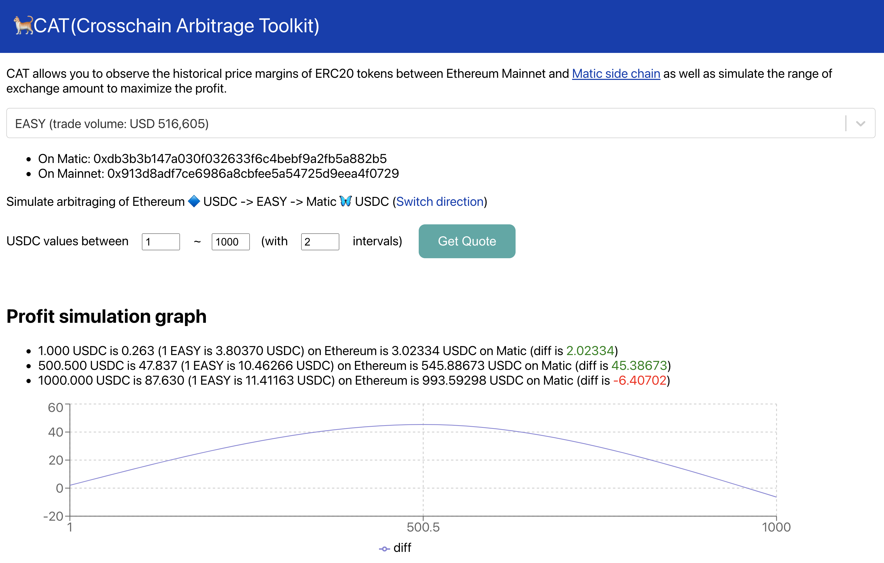

# CAT(Crosschain Arbitrage Toolkit)🐈



Cat(Crosschain Arbitrage Toolkit) allows you to observe the historical price margins of ERC20 tokens between Ethereum Mainnet and Matic side chain.

- [Explainer video]()
- [Demo site](https://matic-arb-graph.surge.sh)

## How to set up

```
git clone https://github.com/makoto/matic-arb-graph
cd  matic-arb-graph/packages/react-app
yarn
yarn start
```

## API used

- Matic
- Aavegotch smart contract to get aToken -> maToken specific address mapping info
- [TheGraph](https://thegraph.com/explorer/subgraph/maticnetwork/mainnet-root-subgraphs) = to get token address mapping info

